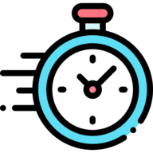

# Inbriefs: Your Bite-Sized News App

Welcome to Inbriefs, the ultimate news app that delivers concise news excerpts in just 100 words. Stay updated on the go without the hassle of reading lengthy articles.

## Why did I build the app?

In short, Inbriefs was a product of my own need and frustration. As a busy individual, I constantly found it difficult to keep up with the world news amidst my hectic schedule. 

Reading through entire articles was not an option and I felt that current news apps did not provide a solution to my problem. With this in mind, I decided to create Inbriefs. Its purpose is to cut through the noise, condensing news articles into brief, 100-word summaries, making it possible for people like me to stay informed without having to invest a lot of time.

## Features

- **Bite-Sized News**: Get a quick overview of news stories in just 100 words, saving you time and effort.
- **Mobile-Optimized**: Designed exclusively for mobile devices, ensuring a seamless news-reading experience.
- **Personalized Feed**: Tailor your news feed to your interests, so you're always informed about what matters to you.
- **Engagement Options**: Like, share, and bookmark news snippets to revisit or share them easily.
- **Night Mode**: Enjoy reading the news comfortably in low-light conditions with the built-in night mode.
- **Social Login**: Sign in conveniently using your google account for a hassle-free experience.

## Tech Stacks

## Demo
Link: https://cln.sh/mhF0vGCH

## License

This project is licensed under the MIT License.
